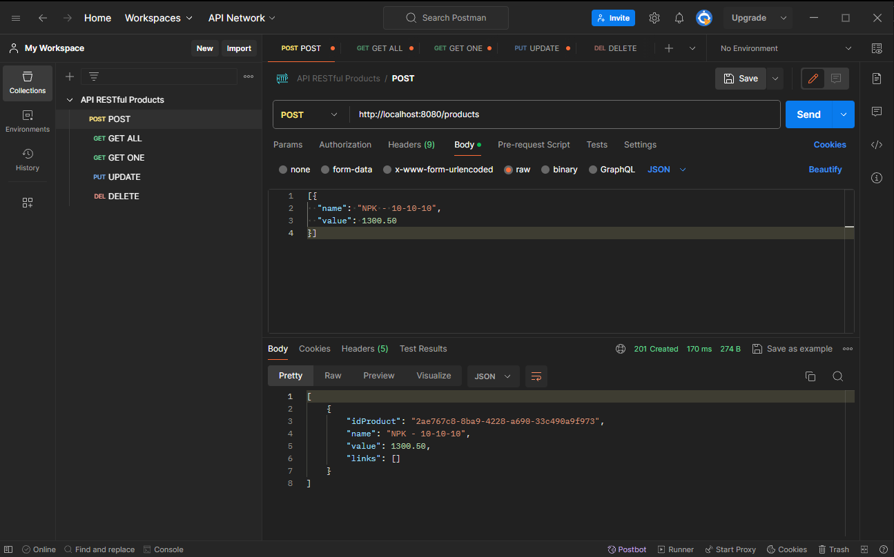

# API RESTful - Loja Virtual de Produtos

Esta API RESTful permite realizar operações CRUD (Create, Read, Update, Delete) em um banco de dados associado a uma loja virtual de produtos. A API é construída utilizando Spring Framework, Swagger para documentação e PostgreSQL para o banco de dados. [(Documentation in english here.)](README_en.md)

## Recursos Principais

1. **Listagem de Produtos:**
    - Endpoint: `/products`
    - Método: GET ALL
    - Descrição: Retorna a lista completa de produtos disponíveis na loja. É possível filtrar por paginas utilizando o query "?page=x&size=y".

2. **Detalhes do Produto:**
    - Endpoint: `/products/{id}`
    - Método: GET ONE
    - Descrição: Retorna detalhes específicos de um produto com base no ID fornecido.

3. **Adição de Produto:**
    - Endpoint: `/products`
    - Método: POST
    - Descrição: Adiciona um novo produto à loja com base nos dados fornecidos. É necessário informar nome e valor do produto através de formato JSON. Também é possível adicionar diversos produtos em uma única requisição.

4. **Atualização de Produto:**
    - Endpoint: `/products/{id}`
    - Método: PUT
    - Descrição: Atualiza informações de um produto existente com base no ID fornecido. É necessario informar nome e valor do produto através de formato JSON, como no método POST.

5. **Remoção de Produto:**
    - Endpoint: `/products/{id}`
    - Método: DELETE
    - Descrição: Remove um produto específico da loja com base no ID fornecido.

## Como Usar

1. **Instalação:**
    - Clone o repositório: `git clone https://github.com/cas-melo/products-api.git`

2. **Configuração do Banco de Dados:**
    - Configure as informações de conexão ao banco de dados no arquivo `springboot\springboot\target\classes\application.properties` (ou equivalente).

3. **Execução da API:**
    - Inicie o servidor: RUN em `SpringbootApplication` (ou equivalente).

4. **Exemplos de Requisições:**
    - Consulte os screenshots abaixo para obter exemplos de requisições usando ferramentas como cURL ou Postman.

## Screenshots

*Método POST, observe os valores informados em formato JSON no corpo da requisição.*

*Método GET ALL.*

*Método GET ALL com o filtro de paginação. Observe o formato da requisição, utilizando ?page=x&size=y para delimitar a quantidade de páginas e produtos por página.*

*Método PUT.*

*Método DELETE.*

*Documentação da API feita com Swagger.*

*Banco de dados feito utilizando PostgreSQL.*

## Contribuição

Sinta-se à vontade para contribuir ou reportar problemas. Basta abrir uma *issue* ou enviar um *pull request*.

## Licença

Este projeto está licenciado sob a [MIT License] - veja o arquivo [LICENSE.md](LICENSE.md) para detalhes.
