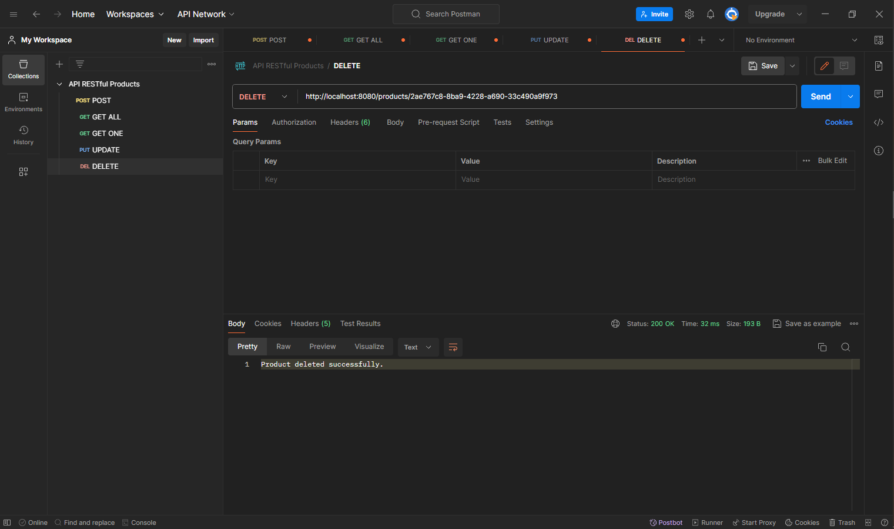
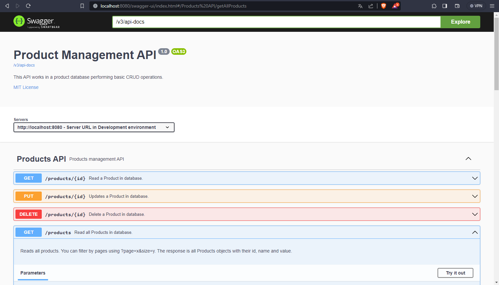

# RESTful API - Online Products Store

This RESTful API allows performing CRUD (Create, Read, Update, Delete) operations on a database associated with an online products store. The API is built using the Spring Framework, Swagger for documentation, and PostgreSQL for the database.

## Key Features

1. **Listing Products:**
    - Endpoint: `/products`
    - Method: GET ALL
    - Description: Returns the complete list of products available in the store. You can filter by pages using the query parameter "?page=x&size=y".

2. **Product Details:**
    - Endpoint: `/products/{id}`
    - Method: GET ONE
    - Description: Returns specific details of a product based on the provided ID.

3. **Adding a Product:**
    - Endpoint: `/products`
    - Method: POST
    - Description: Adds a new product to the store based on the provided data. You need to provide the name and value of the product in JSON format. It's also possible to add multiple products in a single request.

4. **Updating a Product:**
    - Endpoint: `/products/{id}`
    - Method: PUT
    - Description: Updates information for an existing product based on the provided ID. You need to provide the name and value of the product in JSON format, similar to the POST method.

5. **Removing a Product:**
    - Endpoint: `/products/{id}`
    - Method: DELETE
    - Description: Removes a specific product from the store based on the provided ID.

## Authentication and Authorization

The API now has an authentication and authorization system using Spring Security and JWT Token. There are two roles: Admin and User.

### Roles

- **Admin:** Has permissions to add, update, and delete products.
- **User:** Can only perform read operations on products.

### Authentication

Authentication is performed through a Bearer Token generated during the login process. To obtain the token, make a login request with the appropriate credentials.

#### Login Endpoint:

- **Endpoint:** `/auth/login`
- **Method:** POST
- **Description:** Performs login and returns a valid Bearer Token.

#### Registration Endpoint:

- **Endpoint:** `/auth/register`
- **Method:** POST
- **Description:** Registers the user in the database.
- Example JSON request:

```json
{
  "login": "your_login",
  "password": "your_password",
  "roles": ["USER/ADMIN"]
}
```

## How to Use

1. **Installation:**
    - Clone the repository: `git clone https://github.com/cas-melo/products-api.git`

2. **Database Configuration:**
    - Configure the database connection information in the file `springboot\springboot\target\classes\application.properties` (or equivalent).

3. **Running the API:**
    - Start the server: RUN in `SpringbootApplication` (or equivalent).

4. **Request Examples:**
    - Refer to the screenshots below for examples of requests using tools like cURL or Postman.

## Screenshots

*POST method, observe the values provided in JSON format in the request body.*


*GET ALL method.*


*GET ALL method with pagination filter. Observe the request format, using ?page=x&size=y to limit the number of pages and products per page.*


*PUT method.*


*DELETE method.*


*API documentation made with Swagger.*


*Database using PostgreSQL.*


## Contribution

Feel free to contribute or report issues. Simply open an issue or submit a pull request.

## License

This project is licensed under the [MIT License] - see the [LICENSE.md](LICENSE.md) file for details.
